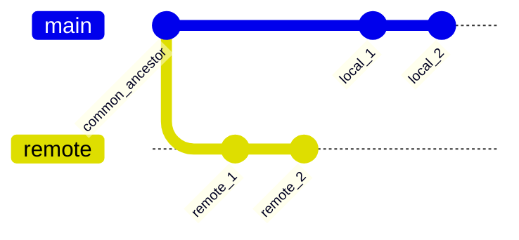

# Git Divergence Audit Skill (v1)

This skill provides a high-fidelity protocol for auditing divergence between two Git branches (e.g., `main` and `origin/main`). It ensures that every unique technical asset, metadata change, and historical gap is accounted for before any reconciliation (REBASE/MERGE) occurs.

***

## 1. Environment & Dependencies

Before execution, the agent **MUST** verify the industrial environment.

1. **Verify Git**:
   ```powershell
   git --version
   ```
2. **Verify PowerShell**:
   ```powershell
   $PSVersionTable.PSVersion
   ```
3. **Verify Git PAGER**:
   Ensure `PAGER=cat` is used for all Git commands to prevent terminal hangs.

***

## 2. Divergence Discovery

Identify the relationship between the local HEAD and the remote source of truth.

1. **Find Common Ancestor (Merge-Base)**:
   ```powershell
   $CommonBase = git merge-base <local_branch> <remote_branch>
   ```
   * *Returns the hash of the last shared commit.*

2. **Automated Audit Execution**:
   Execute the industrial audit script (PS5.1/Core compatible) to identify the "Ahead" and "Behind" commit counts.
   ```powershell
   ./scripts/audit.ps1 -LocalBranch "main" -RemoteBranch "origin/main" -Markdown
   ```

***

## 3. Asset Auditing (Unit-by-Unit)

Perform a surgical audit of the technical assets changed in the divergent gap.

### 3.1 Categorization Matrix
Every change must be assigned to one of these industrial categories:
- **Technical Asset**: Skills (`.agents/skills/`), scripts, rules (`ai-agent-rules/`), core logic changes.
- **Documentation**: README, AGENTS.md, docs/.
- **Metadata/Noise**: IDE configs (`.vscode/`), placeholder updates, whitespace.

### 3.2 Commit Action Mapping (CAM)
Generate a table of proposed actions for the reconciliation phase:

| Commit Hash | Author | Category | Proposed Action (KEEP/DROP/SQUASH/REWORD) | Rationale |
| :--- | :--- | :--- | :--- | :--- |
| `[HASH]` | [NAME] | Technical | KEEP | Industrial skill implementation |
| `[HASH]` | [NAME] | Noise | DROP | Trailing comma in .vscode |

***

## 4. Historical Mapping

Visualize the divergence structure to understand branch relationships.



***

## 5. Tree Parity Verification

Once reconciliation is planned, verify content consistency between the Tips.

1. **Parity Check**:
   ```powershell
   git diff --stat <local_branch> <remote_branch>
   ```
   * *Expected Result: Zero delta for technical assets after reconciliation.*

***

## 6. Related Conversations & Traceability

- Standard established during the **Industrial AI Agent Repository History** session (March/April 2026).
- Follows [Skill Factory Protocol](../skill_factory/SKILL.md).
- Compliance: 100% Rule 1.1 (tilde-portable).
- Compatibility: PowerShell 5.1/Core.
