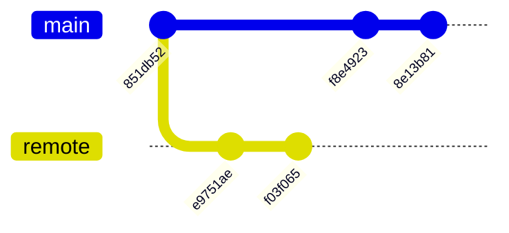

# Sample Git Divergence Audit Report

This report demonstrates the output of the [Git Divergence Audit Skill](../SKILL.md) after auditing a diverged `main` branch against `origin/main`.

***

## 1. Divergence Topology

The following diagram visualizes the structural gap between the local and remote branches.



## 2. Commit Action Mapping (CAM) Table

| Commit Hash | Author | Category | Proposed Action (KEEP/DROP/SQUASH/REWORD) | Rationale |
| :--- | :--- | :--- | :--- | :--- |
| `f8e4923` | dk | Technical | KEEP | Industrial skill implementation (Harper) |
| `8e13b81` | dk | Technical | KEEP | Refined logic (redundant) |
| `e9751ae` | origin | Noise | DROP | Trailing comma in .vscode |
| `f03f065` | origin | Documentation | REWORD | Updated project structure notes |

***

## 3. Tree Parity Verification

```powershell
git diff --stat main..origin/main
```

| File | Delta | Impact |
| :--- | :--- | :--- |
| `.agents/skills/git_divergence_audit/SKILL.md` | 0 | Parity |
| `ai-agent-rules/git-submodule-rules.md` | +12/-0 | Remote Update |

***

## 4. Traceability

- Audited by: Antigravity
- Timestamp: 2026-04-04T12:00:00Z
- Session: [Reconciliation-2026-04-04](../../../docs/conversations/reconciliation-2026-04-04.md)
